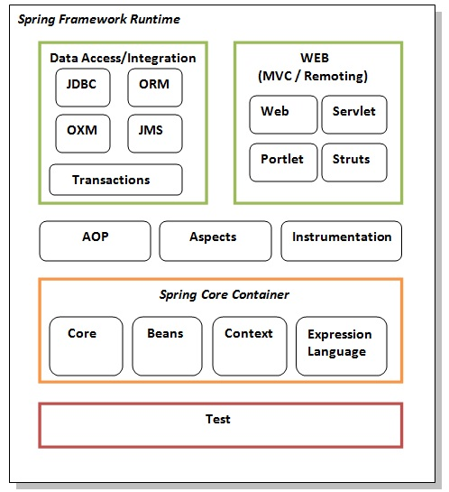

# Spring

Spring is a comprehensive, modular Java framework designed to simplify the development of Java enterprise applications.

🎯 Goals:

* Reduce boilerplate code
* Promote loose coupling
* Enable declarative programming
* Support testability, modularity, and AOP (Aspect-Oriented Programming)
*

📦 Key Modules:

1. Core Container: Beans, Core, Context, Expression Language
2. Spring AOP
3. Spring ORM (Hibernate/JPA)
4. Spring MVC
5. Spring Boot, Security, etc.

## 1. Spring Core

[Spring Core](src/main/java/springCore/Spring%20Core.md)