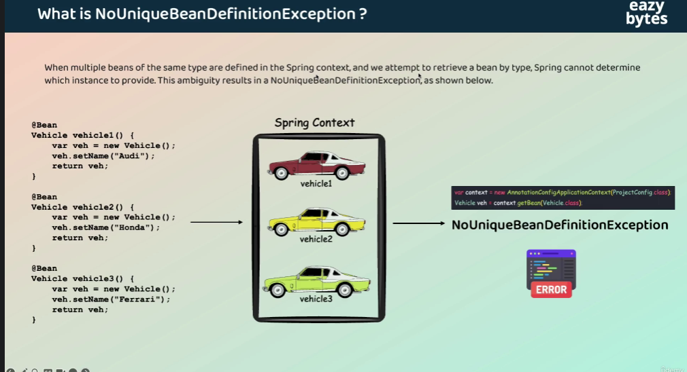
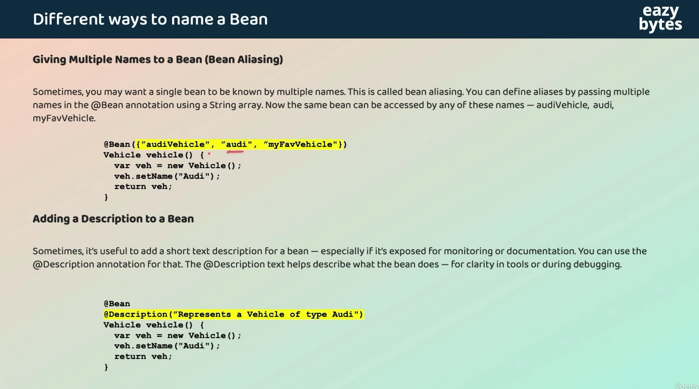

# How Does a Class Become a Spring Bean?

There are several ways.

Component scanning

    @Component
    public class PaymentService {
    }

or specialized stereotypes:

    @Service
    public class PaymentService {
    }
    @Repository
    public class PaymentRepository {
    }

Spring discovers these through component scanning.

Java configuration
```java
@Configuration
public class AppConfig {

    @Bean
    public PaymentService paymentService() {
        return new PaymentService();
    }
}
```
XML configuration
```xml
<bean id="paymentService"
class="com.example.PaymentService"/>
```



#### solution: 

    Vehicle vh=context.getBean("vehicle1",Vehicle.class)

### Naming Bean , description and aliases


## Bean Lifecycle

```java
1. Spring reads BeanDefinition
          ↓
2. Bean Instantiation
          ↓
3. Dependency Injection / Property Population
          ↓
4. Aware callbacks
          ↓
5. BeanPostProcessor
   postProcessBeforeInitialization()
          ↓
6. Initialization callbacks
          ↓
   @PostConstruct
          ↓
   InitializingBean.afterPropertiesSet()
          ↓
   custom init-method
          ↓
7. BeanPostProcessor
   postProcessAfterInitialization()
          ↓
8. Bean is ready
          ↓
9. Application uses Bean
          ↓
10. Spring Container shuts down
          ↓
11. Destruction callbacks
          ↓
    @PreDestroy
          ↓
    DisposableBean.destroy()
          ↓
    custom destroy-method
```
```java
package com.example.lifecycle;

import jakarta.annotation.PostConstruct;
import jakarta.annotation.PreDestroy;
import org.springframework.beans.factory.BeanNameAware;
import org.springframework.beans.factory.DisposableBean;
import org.springframework.beans.factory.InitializingBean;
import org.springframework.context.annotation.AnnotationConfigApplicationContext;
import org.springframework.stereotype.Component;

@Component
class StudentService
        implements BeanNameAware, InitializingBean, DisposableBean {

    public StudentService() {
        System.out.println("1. Constructor: Bean object created");
    }

    @Override
    public void setBeanName(String name) {
        System.out.println("2. BeanNameAware: Bean name is " + name);
    }

    @PostConstruct
    public void postConstruct() {
        System.out.println("3. @PostConstruct: Initialization logic");
    }

    @Override
    public void afterPropertiesSet() {
        System.out.println("4. InitializingBean: afterPropertiesSet()");
    }

    public void useService() {
        System.out.println("5. Bean is ready and being used");
    }

    @PreDestroy
    public void preDestroy() {
        System.out.println("6. @PreDestroy: Cleanup logic");
    }

    @Override
    public void destroy() {
        System.out.println("7. DisposableBean: destroy()");
    }
}

public class BeanLifecycleApplication {

    public static void main(String[] args) {
        AnnotationConfigApplicationContext context =
                new AnnotationConfigApplicationContext(
                        "com.example.lifecycle"
                );

        StudentService studentService =
                context.getBean(StudentService.class);

        studentService.useService();

        context.close();
    }
}
```
Output:
```java
1. Constructor: Bean object created
2. BeanNameAware: Bean name is studentService
3. @PostConstruct: Initialization logic
4. InitializingBean: afterPropertiesSet()
5. Bean is ready and being used
6. @PreDestroy: Cleanup logic
7. DisposableBean: destroy()
```
### BeanPostProcessor
BeanPostProcessor allows Spring to process a bean before and after initialization.

It has two important methods:

    postProcessBeforeInitialization()
    postProcessAfterInitialization()

### Why is this important?

Spring itself uses post-processing extensively for framework features.

You don't normally write custom BeanPostProcessors in everyday application development, but you should understand their role in the lifecycle.
```java
@Component
public class MyBeanPostProcessor
        implements BeanPostProcessor {

    @Override
    public Object postProcessBeforeInitialization(
            Object bean,
            String beanName) {

        System.out.println(
                "Before initialization: " + beanName);

        return bean;
    }

    @Override
    public Object postProcessAfterInitialization(
            Object bean,
            String beanName) {

        System.out.println(
                "After initialization: " + beanName);

        return bean;
    }
}
```

