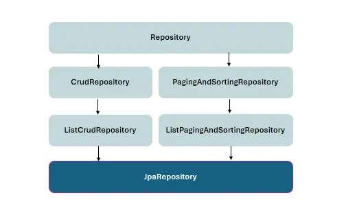

# Spring Data JPA

## JPA (Jakarta Persistence API)
JPA (Jakarta Persistence API) is a Java specification that defines a standard way to map Java objects to relational database tables and perform persistence operations.

It defines APIs, annotations, interfaces, and rules for Object-Relational Mapping (ORM).

### Why JPA exists

Without an ORM framework, Java applications have to manually:

Write SQL queries.
Create JDBC connections.
Map ResultSet data to Java objects.
Handle insert/update/delete operations.
Manage entity state.
Handle relationships between objects and tables.

JPA provides a standard programming model for these operations.

# Spring Data JPA?

Spring Data JPA is a Spring project that provides a higher-level repository abstraction on top of JPA.

Its main purpose is to reduce the amount of persistence-related code developers need to write.

Instead of manually implementing common CRUD operations with EntityManager, you can define a repository interface:

```java
public interface EmployeeRepository
        extends JpaRepository<Employee, Long> {
}
```
Main purpose

Spring Data JPA provides:

* Repository abstraction
* CRUD operations
* Query method derivation
* Pagination
* Sorting
* JPQL queries
* Native queries
* Specifications
* Integration with Spring transactions
* Integration with Spring's dependency injection

## Repository Hierarchy


### 1. Repository<T, ID>

The root repository interface.

    Repository<Employee, Long>
Purpose
* Marker interface for Spring Data repositories.
* Provides no CRUD methods by itself.
* Used when you want to create a very restricted/custom repository interface.

    public interface EmployeeRepository
    extends Repository<Employee, Long> {
    }

You explicitly declare only the methods you want.

### 2. CrudRepository<T, ID>
[Detailed Notes](../springDataJPA/Repositories/CRUDrepository.md)

Provides basic CRUD operations.

    CrudRepository<Employee, Long>
Main operations
* save()
* findById()
* findAll()
* existsById()
* count()
* deleteById()
* delete()
* deleteAll()
Important

CrudRepository traditionally returns Iterable for methods such as:

    Iterable<Employee> findAll();

It does not provide paging or sorting.

### 3. ListCrudRepository<T, ID>

Introduced in Spring Data 3.x.

It provides the same basic CRUD capability as CrudRepository, but collection-returning methods use List instead of Iterable.

    ListCrudRepository<Employee, Long>

For example:

    List<Employee> findAll();
Purpose

CRUD operations + convenient List return types.

### 4. PagingAndSortingRepository<T, ID>
[Detailed Notes](../springDataJPA/Repositories/PagingAndSortingRepository.md)

Provides:

* Pagination
* Sorting
  

     PagingAndSortingRepository<Employee, Long>

Example:

    Iterable<Employee> findAll(Pageable pageable);

and:

    Iterable<Employee> findAll(Sort sort);
Important Spring Data 3 change

PagingAndSortingRepository does NOT extend CrudRepository anymore.

Therefore:

PagingAndSortingRepository
✗
does not automatically provide CRUD methods

This separation was introduced in Spring Data 3.

### 5. ListPagingAndSortingRepository<T, ID>

Introduced in Spring Data 3.x.

It provides paging and sorting while using List return types where applicable.

    ListPagingAndSortingRepository<Employee, Long>

For example:

    List<Employee> findAll(Sort sort);
Purpose

Paging + sorting with List-based results.

### 6. JpaRepository<T, ID>

This is the most commonly used repository interface in Spring Data JPA applications.

```java
public interface EmployeeRepository
extends JpaRepository<Employee, Long> {
}
```

It combines the major repository capabilities.
It also provides JPA-specific functionality, such as:

```java
flush()
saveAndFlush()
saveAllAndFlush()
deleteAllInBatch()
deleteAllByIdInBatch()
getReferenceById()
```